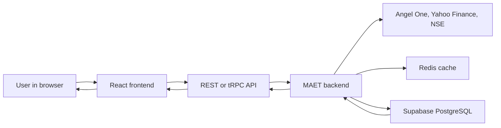

# MAET Project Guide

This guide explains MAET in simple language. Read the first two sections before an interview; use the rest as a map when someone asks how the project works.

## The short version

**MAET** means **Market Analytics & Execution Terminal**. It is a TypeScript web application for researching Indian-market data, viewing charts and screeners, testing strategies, and practising with paper trades.

It is **not** a real-money trading platform. It does not send brokerage orders. Market data can be delayed or unavailable depending on the configured provider.

## A 60-second interview answer

> I built MAET as a market-research and paper-trading terminal for Indian equities. The frontend uses React and TypeScript to show tables, charts, screeners, and paper-trading screens. The backend uses Nitro and tRPC to provide typed APIs, validate requests, and coordinate market data. It can collect data from Angel One, Yahoo Finance, and NSE sources, cache or process it, and store durable records in Supabase PostgreSQL through Drizzle ORM. I separated reusable data contracts into a shared package, used background workers for tasks such as price collection and paper-order matching, and kept real-money order execution deliberately out of scope.

If the interviewer asks what you learned, say:

> The main learning was how a real application connects a React interface, typed APIs, external data providers, background jobs, caching, and a relational database while being honest about data quality and product limits.

## The simple mental model

Think of MAET as three connected parts:

| Part | Simple explanation | Main folder |
|---|---|---|
| The screen | What the user sees and clicks: charts, tables, forms, navigation, and status messages. | `src/` |
| The engine room | The server that validates requests, fetches data, runs calculations, and applies paper-trading rules. | `server/` |
| The shared vocabulary | Common definitions that make sure the screen and server agree on names and data shapes. | `shared/` |

There is also a database for saved information and external providers for market information.



## How market data reaches the user

### Example: a quote on a chart or screener

1. A user opens a page such as the screener, terminal, or a stock page.
2. A React hook, such as `src/hooks/use-market-quotes.ts`, asks for the symbols it needs.
3. The frontend uses the market API client in `src/lib/market-api.ts`. It checks that the returned JSON has the expected shape before the screen uses it.
4. The request reaches a backend endpoint such as `server/api/market/quotes.get.ts`.
5. The backend's quote service tries a configured Angel One quote for a mapped symbol and can fall back to Yahoo Finance when necessary.
6. The backend marks the response with its source and whether it is delayed. It does not present Yahoo data as live data.
7. The frontend caches the answer briefly and renders it as a table row, price card, chart, or status message.

For live-style updates, `server/api/market/stream.get.ts` keeps a Server-Sent Events connection open. It sends an initial snapshot and then sends new ticks. The browser updates only the affected data instead of reloading the whole page.

### Example: longer-term company data

1. The backend orchestrator starts its workers when the server starts.
2. A daily processor can load the NSE company master, Yahoo historical candles, and available fundamentals.
3. The data is checked and normalised before it is stored.
4. Drizzle sends database queries to Supabase PostgreSQL.
5. Screeners, charts, and backtests can read the stored data later.

### Example: paper trading

1. The user enters a paper order in the React interface.
2. The frontend sends a signed-in tRPC request with the user's Supabase access token.
3. The backend checks the user, validates the input, and checks whether a quote is safe enough for paper execution.
4. For an immediately executable paper order, it writes the order, fill, position, ledger entries, and related events in a database transaction.
5. A limit or stop paper order can remain pending; background matching watches later ticks and performs the fill when its rule is met.
6. The frontend refreshes the paper account, orders, positions, and portfolio view.

This is simulated trading only. No inspected server path sends an order to a broker.

## Where to look first

Use this order when you want to understand the code without getting lost:

1. `README.md` — product purpose, data sources, setup, and honest limitations.
2. `package.json` — main commands and the three workspaces.
3. `src/routes/` — visible pages in the browser.
4. `src/hooks/` and `src/lib/` — how pages ask for data.
5. `server/api/` — backend doors that receive browser requests.
6. `server/domain/` and `server/modules/` — business rules and calculations.
7. `server/data/` and `server/workers/` — provider connections and background work.
8. `server/db/` — database table definitions and migrations.
9. `shared/` — the contracts used by both frontend and backend.

## Project map

### Root files

| File or folder | What it is used for |
|---|---|
| `README.md` | Main product documentation, setup instructions, architecture overview, and limitations. |
| `PROJECT_GUIDE.md` | This beginner and interview guide. |
| `package.json` | Main Bun workspace configuration and project-wide commands. |
| `bun.lock` | Records the exact Bun package versions installed for reproducible builds. |
| `package-lock.json` | npm lockfile retained by the repository. Bun is the primary command runner. |
| `tsconfig.json` | Shared TypeScript compiler settings. |
| `.env.example` | Safe list of environment-variable names needed for local configuration. Never put real secrets in Git. |
| `.env.test` | Test-only environment settings. |
| `render.yaml` | Render deployment recipe for the backend service. |
| `vercel.json` | Vercel deployment configuration for the frontend output. |
| `playwright.config.ts` | Browser-test configuration. |
| `eslint.config.js`, `.prettierrc`, `.prettierignore` | Code-quality and formatting rules. |
| `components.json` | UI-component generator configuration. |
| `insert_baselines.sql` | SQL helper used for baseline database data. |
| `scripts/` | Small project-level helper scripts. |
| `.github/` | GitHub workflows and repository automation. |

### `src/`: the frontend

This folder is the website users interact with. It is built mainly with React, TypeScript, TSX, Tailwind CSS, and TanStack Start.

| Location | What it does |
|---|---|
| `src/start.ts` | Creates the TanStack Start application and its server-side error handling. |
| `src/router.tsx` | Creates the router and React Query cache used by the frontend. |
| `src/server.ts` | Frontend server entry used by the framework build. |
| `src/routes/__root.tsx` | The shared root HTML page and application providers. |
| `src/routes/_app.tsx` | The logged-in/shared application layout. |
| `src/routes/index.tsx` | The public landing page. |
| `src/routes/_app.*.tsx` | One file per screen, such as screener, terminal, portfolio, alerts, orders, workspace, strategies, and replay. |
| `src/routes/_app.stock.$symbol.tsx` | A dynamic stock page. `$symbol` means the URL supplies the selected stock symbol. |
| `src/routes/_app.options.$underlying.tsx` | An options screen for an underlying symbol. It honestly shows unavailable data when no verified options feed is wired to that screen. |
| `src/routes/api.market.*.ts` | Frontend/server helper routes for market requests, validation, and caching. |
| `src/components/` | Reusable visual building blocks. `trading/` holds market widgets, `chart/` and `charting/` hold charts, `workspace/` holds saved-workspace widgets, and `ui/` holds generic buttons, dialogs, tables, tabs, and forms. |
| `src/hooks/` | Reusable data and interaction logic. Examples include quote, candle, stream, paper-account, portfolio, and workspace hooks. |
| `src/lib/market-api.ts` | Defines and validates market API responses before the UI trusts them. |
| `src/lib/trpc.ts` | Browser client for signed-in tRPC features such as paper trading, workspace, alerts, backtests, and strategies. |
| `src/lib/auth-token.ts` | Retrieves and refreshes the browser's Supabase access token. |
| `src/lib/paper-sse-client.ts` | Receives paper-trading updates through a stream. |
| `src/lib/technical-indicators.ts`, `src/lib/financial-metrics.ts` | Frontend-side helper calculations and formatting for displayed analysis. |
| `src/store/` | Small browser-only state. For example, a selected terminal symbol belongs here, not in the durable database. |
| `src/styles.css` | Global Tailwind CSS setup, theme variables, typography, colours, and animations. |
| `src/routeTree.gen.ts` | Generated route information. Do not normally edit this file by hand. |
| `src/vite.config.ts` | Frontend build-tool configuration. |
| `src/scripts/` | Build and preview helper scripts. |

### `server/`: the backend

This folder contains the web server, APIs, provider integrations, business rules, workers, and database access. It is written mainly in TypeScript and runs with Nitro/H3, Bun during development, and Node.js on Render.

| Location | What it does |
|---|---|
| `server/plugins/orchestrator.ts` | Starts the market-data and background-work coordinator when the Nitro server starts. |
| `server/orchestrator.ts` | Starts and stops workers, manages market subscriptions, and attempts Angel One login when credentials are configured. |
| `server/app.ts` | Builds the H3 app and registers CORS and health endpoints. Nitro also discovers the file-based API routes. |
| `server/config.ts` | Reads and validates server settings and secret names. |
| `server/api/` | File-based REST and streaming endpoints. For example, `market/quotes.get.ts`, `market/candles.get.ts`, and `market/stream.get.ts`. |
| `server/api/trpc/[trpc].ts` | The tRPC entry point used by signed-in frontend features. |
| `server/api/trpc/auth.ts` | Verifies Supabase JWT access tokens. |
| `server/api/trpc/core.ts` | Defines public, protected, and admin tRPC procedures. |
| `server/api/trpc/index.ts` | Collects the feature routers into one tRPC API. |
| `server/api/trpc/routers/` | Feature-specific API logic: companies, market data, paper trading, portfolio, alerts, screeners, data quality, strategy jobs, and backtests. |
| `server/data/sources/` | Adapters for external providers: Angel One, Yahoo Finance, NSE company master, NSE index constituents, and fundamentals sources. |
| `server/data/sources/angelone/client.ts` | Angel One login, authenticated quote requests, option-Greek capability, and NFO option-contract resolver. The option capability is foundation work and is not yet a fully wired user feature. |
| `server/data/sources/yahoo.ts` | Yahoo quote and candle retrieval, retry handling, source timestamps, and cache use. Yahoo data is marked delayed. |
| `server/data/drizzle/client.ts` | Connection layer between TypeScript code and Supabase PostgreSQL. |
| `server/data/redis/` | Redis/Upstash cache client, keys, and test helpers. |
| `server/domain/` | Reusable rules and calculations, including quote services, indicator logic, screening, portfolios, and strategy evaluation. |
| `server/domain/market/quote-service.ts` | Chooses the market quote path, preferring eligible Angel One data and falling back to Yahoo when needed. |
| `server/domain/market/quote-store.ts` | Keeps the latest ticks in process memory for fast live updates. |
| `server/modules/` | Feature-level business workflows. The paper-trading module handles orders, fills, positions, ledger entries, and service rules. |
| `server/workers/` | Background tasks such as Yahoo polling, Angel One WebSocket processing, candle writing, alert evaluation, paper-order matching, daily processing, and strategy workers. |
| `server/workers/ingestion-engine/` | A more structured ingestion pipeline with normalisation, validation, retry/dead-letter handling, Supabase writes, and optional BigQuery output. |
| `server/db/schema.ts` | TypeScript description of database tables for Drizzle ORM. |
| `server/db/migrations/` | Numbered SQL upgrades for PostgreSQL. New migrations only add forward-safe changes; for example, `0017_options_market_data.sql` adds the options-data foundation. |
| `server/infra/` | Shared technical services such as the internal event bus, encryption, health status, logging, and metrics. |
| `server/middleware/` | Request-wide behavior such as CORS rules. |
| `server/routes/` | Additional server route handlers, including health checks. |
| `server/scripts/` | Server-side operational scripts, such as a database connection check. |
| `server/nitro.config.ts` | Nitro build, aliases, ignored files, and route-cache configuration. |

### `shared/`: the agreement between frontend and backend

The frontend and backend both need to agree on what a quote, candle, order, paper fill, or strategy looks like. This folder prevents two separate and inconsistent definitions.

| Location | What it does |
|---|---|
| `shared/types/market.ts` | Zod schemas and TypeScript types for quotes, ticks, candles, sources, data quality, and execution-quote safety. |
| `shared/types/order.ts` | Shared order-related types. |
| `shared/types/errors.ts` | Shared error types used by data-source code. |
| `shared/domain/paper-trading/` | Pure paper-trading domain rules, including execution, margin, and position reconciliation. |
| `shared/screener/` | Screener query language and validation schema. |
| `shared/strategy/` | Strategy-language AST, operators, contracts, schemas, and versions. |
| `shared/research/` | Research-workspace contracts and schemas. |
| `shared/symbols/nifty50.json` | Static NIFTY 50 symbol information used by the application. |

## How to read file names

These naming rules help you understand almost every file without opening it first.

| Pattern | Meaning |
|---|---|
| `*.test.ts` | An automated test for the nearby feature. |
| `*.get.ts` | A backend GET endpoint. |
| `*.post.ts` | A backend POST endpoint. |
| `*.delete.ts` | A backend DELETE endpoint. |
| `[trpc].ts` | The catch-all tRPC API entry point. |
| `$symbol.tsx` | A page where the URL provides a value named `symbol`. |
| `_app.*.tsx` | A page that uses the main application layout. |
| `client.ts` | A connection/client for another service or resource. |
| `schema.ts` | A data-shape definition or validation schema. |
| `*.sql` in `server/db/migrations/` | A versioned database change. Read them in number order. |
| `*.gen.ts` | Generated code. Avoid hand-editing it unless the generator requires it. |

## Languages and tools, in plain English

| Technology | Where it is used | Why it exists |
|---|---|---|
| TypeScript | Almost everywhere | JavaScript with type checks, helping frontend and backend agree about data. |
| TSX | `src/` pages and components | TypeScript with HTML-like React markup for building screens. |
| React 19 | `src/components/` and `src/routes/` | Creates interactive user-interface pieces. |
| TanStack Start and Router | `src/` routing | Maps route files to URLs and supports rendering the app. |
| TanStack React Query | Frontend hooks and router | Fetches, caches, refreshes, and updates server data. |
| Zod | `shared/`, `src/lib/`, and `server/api/` | Checks that input and returned JSON have safe, expected shapes. |
| Nitro and H3 | `server/` | Runs the HTTP server and file-based API routes. |
| tRPC | `server/api/trpc/` and `src/lib/trpc.ts` | Gives signed-in frontend and backend code a typed API boundary. |
| PostgreSQL | Supabase database | Stores durable company data, paper trades, user workspaces, strategy jobs, and more. |
| Drizzle ORM | `server/data/drizzle/` and `server/db/schema.ts` | Lets TypeScript code work with PostgreSQL tables safely. |
| SQL | `server/db/migrations/` | Defines and upgrades the actual database structure. |
| Redis / Upstash | `server/data/redis/` | Keeps short-lived cached data and supports coordination. |
| Bun | Root commands and tests | Installs packages, runs TypeScript scripts, and runs tests. |
| Node.js | Render production runtime | Runs the deployed backend service. |
| Tailwind CSS and CSS | `src/styles.css` and components | Controls layout, colours, themes, and responsive design. |
| JSON and YAML | Config and data files | Stores package settings, deployment settings, and static data. |

## What is implemented versus what is not safe to claim

### Safe to say

- MAET has a React-based market-research interface with routes for screeners, charts, portfolio views, paper trading, strategy work, alerts, and workspace features.
- It has backend REST, tRPC, and Server-Sent Events paths.
- It has market-provider adapters for Angel One, Yahoo Finance, and NSE-related data.
- It has Supabase/PostgreSQL schema and migration foundations plus Drizzle access code.
- It has paper-trading domain and database flows, not real brokerage execution.
- It has background-worker code for quotes, candles, alerts, daily processing, and strategy-related jobs.

### Say carefully

- **Market data:** Some data can be delayed, stale, provider-dependent, or unavailable. The API carries source and delay information for this reason.
- **Angel One:** The server can use Angel One when credentials and symbol tokens are available. It is not proof that every deployed environment has a live session.
- **Options:** The Angel One options client and normalized options database tables now exist, but no options ingestion worker, tRPC route, or frontend delivery path is wired to them yet.
- **Strategy workers:** Scripts exist for backtests, sweeps, walk-forward analysis, and evaluation. The single Render web-service definition starts the web server; production needs separate worker processes or scheduling for queued jobs.
- **BigQuery:** The ingestion engine has an optional BigQuery output path. Do not say it is actively populated unless that deployment is verified.

### Do not claim

- That MAET sends real orders to a broker.
- That all quotes are live or exchange-grade.
- That the options screen has verified live chain data today.
- That every screen is production-ready just because its route exists.
- That local mock, synthetic, or illustrative calculations are provider-supplied market data. In particular, the portfolio hook's displayed equity curve is generated in the browser from trade data for visualisation; do not present it as an authoritative database-backed performance record.

## Useful commands

Run these from the repository root:

```bash
# Install dependencies
bun install

# Start the frontend in one terminal
bun --cwd src dev

# Start the backend API in a second terminal
bun --cwd server dev

# The root dev command starts the standalone orchestrator only; it does not open the visible website
bun run dev

# Build the frontend
bun run build

# Type-check both frontend and backend
bun run typecheck

# Run the usual test set
bun test

# Run every registered test group
bun run test:all

# Check whether the server can connect to its configured database
bun run check:db
```

## A short interview question-and-answer guide

### Why did you use a shared folder?

The frontend and backend both handle the same concepts, such as quotes, candles, orders, and strategies. Shared types and Zod schemas reduce the risk that one side expects a different data shape from the other.

### How do you keep external market data safe?

The providers are kept behind server-side adapters. The backend validates values and timestamps, identifies the source and quality, handles provider errors, and can use a fallback. The UI receives structured data rather than calling providers directly.

### Why use background workers?

Tasks such as polling prices, matching queued paper orders, evaluating alerts, writing candles, and running long strategy jobs should not block a normal browser request. Workers let the application do that work separately.

### Why use both REST and tRPC?

REST is useful for simple public-style data endpoints and streams. tRPC is useful for internal application features where the TypeScript frontend and backend benefit from a typed, authenticated procedure boundary.

### Why is paper trading important here?

It lets users practise the lifecycle of orders, fills, positions, and profit/loss without sending a real-money order. It is safer for a research product and creates a useful domain model for testing.

### What would you build next?

I would complete one end-to-end vertical slice at a time: connect verified options ingestion to the new tables, expose it through a backend route, show clear availability states in the UI, and add deployment-level worker scheduling. I would keep the same rule: unavailable provider data stays unavailable instead of being invented.

## Final one-line explanation

MAET is a TypeScript market-research and paper-trading terminal that turns provider data into validated APIs, database-backed analysis, and React charts and screens—without pretending to be a real-money trading platform.
