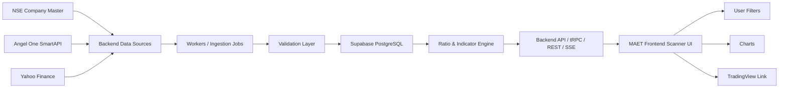
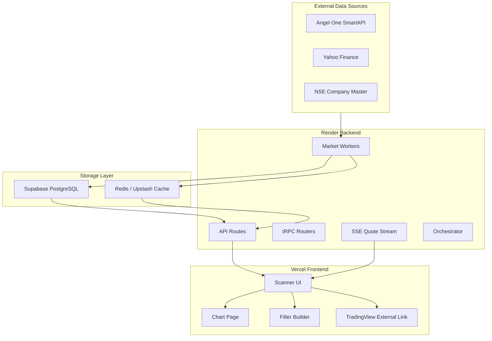
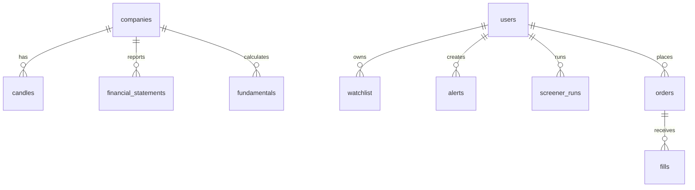
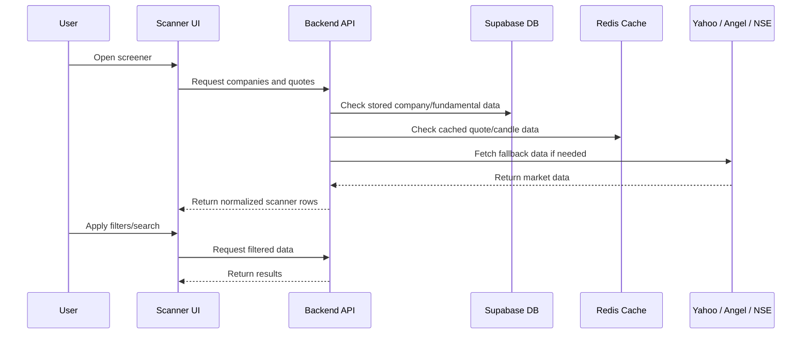
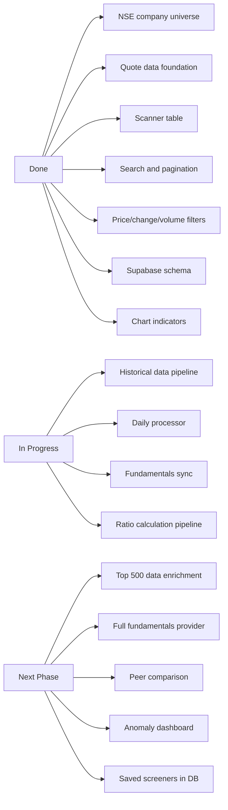

# MAET — Market Analytics & Execution Terminal

> **MAET is a scanner-first Indian market intelligence terminal.**  
> It is built to help users shortlist NSE stocks using company data, market data, filters, charts, indicators, and a database-backed screening pipeline.

Live frontend: https://maet-pi.vercel.app/  
Backend target: Render service  
Database: Supabase PostgreSQL  
Main focus: **Stock Screener / Scanner**

---

## 1. Founder Line

MAET is not a real-money trading platform.  
It is a **demo-ready screener-first market terminal** for Indian stocks.

The goal is simple:

> Pull market and company data automatically, store it in our own database, calculate useful ratios and indicators, validate bad or missing values, and show clean scanner results to users.

---

## 2. What Problem MAET Solves

Checking hundreds of companies manually does not scale.

A proper screener needs:

- a full company universe
- price and volume data
- historical candles
- financial data
- ratio calculations
- technical indicators
- filters
- validation before showing data
- database-backed results

MAET is designed around this idea:

```text
Do not fetch everything live for every scanner request.
Pull data on schedule → store it → validate it → calculate metrics → show scanner results.
```

---

## 3. Current Demo Summary

The current project demonstrates the foundation of a real screener.

### Working now

- NSE company universe support
- Company search and pagination
- Angel One live quote integration
- Yahoo Finance fallback for quotes/candles
- Screener UI with stock table
- Price, change %, and volume based filtering
- Chart page with candlestick chart
- Moving average and RSI indicator wiring
- TradingView-style external chart link support
- Supabase database schema and migrations
- Render backend deployment setup
- Vercel frontend deployment setup
- Honest unavailable-data UI for missing fundamentals

### Partially ready

- Fundamentals database tables
- Ratio calculation foundation
- Historical candle support
- Daily processor / scheduled data pipeline
- Redis caching layer

### Still remaining

- Reliable production financial data provider
- Fully populated financial statements
- P/E, P/B, ROE, ROCE, dividend, growth filters using verified stored data
- Peer comparison
- Anomaly review dashboard
- Database-backed saved screeners
- Production monitoring and alerting

---

## 4. Live Data Pipeline



### Simple explanation

1. **NSE** gives the company universe.
2. **Angel One** gives live quote/token data.
3. **Yahoo Finance** gives fallback quotes and historical candles.
4. Backend workers collect and normalize data.
5. Supabase stores the structured data.
6. Ratio and indicator engines calculate useful metrics.
7. APIs send clean data to the frontend.
8. The scanner UI shows searchable and filterable stock results.

---

## 5. System Architecture



---

## 6. Data Sources Used

| Source | Used For | Why It Is Needed | Status |
|---|---|---|---|
| NSE company master | Company universe, symbols, ISIN, listed companies | Gives official Indian company list | Implemented |
| Angel One SmartAPI | Live quotes, tokens, snapshots | Useful for live market feed | Implemented |
| Yahoo Finance | Delayed quotes, historical candles, fallback data | Helps when live data is unavailable | Implemented |
| Supabase PostgreSQL | Own database | Stores scanner/company/market data | Schema created |
| Redis / Upstash | Cache and real-time support | Reduces repeated API calls and supports fast backend flow | Added |
| TradingView link | External chart open | Lets user open selected stock chart externally | Added |

Important rule:

> Angel One is useful for live market data, but it should not be treated as the main financial fundamentals source.

For production fundamentals, MAET should use:

- NSE/BSE filings
- company reports
- verified public datasets
- licensed fundamentals vendor

---

## 7. Database Design

MAET uses Supabase PostgreSQL as its own database.

The database is needed because for 500+ companies, the scanner should not call Yahoo, NSE, or Angel One live for every request.

### Current tables

| Table | Purpose |
|---|---|
| `users` | User identity/profile support |
| `brokers` | Broker connection records |
| `orders` | Paper/demo order records |
| `fills` | Paper/demo fill records |
| `candles` | Historical OHLCV candle data |
| `watchlist` | User watchlist data |
| `alerts` | Alert rules |
| `screener_runs` | Screener execution history |
| `backtest_runs` | Backtest execution history |
| `companies` | Company master data |
| `financial_statements` | Raw financial statement data |
| `fundamentals` | Calculated or stored fundamental metrics |
| `idempotency` | Prevents duplicate backend operations |

### Target production database design



---

## 8. Screener Flow



---

## 9. What the User Can See in the Demo

The current UI is built like a market terminal with scanner focus.

### Scanner page

The scanner shows:

- symbol
- company name
- price
- change %
- volume
- ISIN
- market/fundamental columns where available
- unavailable data as `—`

### Search

The scanner is intended to support searching by:

- stock symbol
- company name
- ISIN where available

Example searches:

```text
RELIANCE
HDFCBANK
TCS
INFY
20MICRONS
Reliance Industries
```

### Filters

Currently working filter categories:

- price
- change %
- volume

Planned advanced filters:

- market cap
- P/E
- P/B
- ROE
- ROCE
- dividend yield
- EPS growth
- revenue growth
- sector
- industry
- RSI
- moving average signals

### Charts

The chart page supports candlestick visualization and indicator toggles.

Current/planned chart ranges:

```text
1D
5D
1M
6M
1Y
3Y
5Y
All
```

### External TradingView link

Each stock can open a TradingView chart using NSE symbol format, for example:

```text
https://www.tradingview.com/chart/?symbol=NSE:RELIANCE
```

---

## 10. Calculation Engine

The calculation engine should calculate values from stored data, not from random placeholders.

### Formula examples

| Metric | Formula |
|---|---|
| P/E | Market Price / EPS |
| P/B | Market Price / Book Value Per Share |
| ROE | Net Profit / Shareholder Equity |
| ROCE | EBIT / Capital Employed |
| Net Profit Margin | Net Profit / Revenue |
| Debt to Equity | Total Debt / Equity |
| Dividend Yield | Dividend Per Share / Market Price |
| Sales Growth | Current Sales vs Previous Sales |
| RSI | Calculated from historical closing prices |

### Safe calculation rule

```text
If input is missing → return blank
If denominator is zero → return blank
If EPS is negative → P/E is not meaningful
If data is stale → mark it stale
If source mismatch exists → flag before display
```

MAET should never show fake ratio values as real data.

---

## 11. Validation and Anomaly Rules

The scanner should protect users from bad data.

Examples:

| Situation | Output |
|---|---|
| Missing price | Keep ratio blank |
| Missing EPS | P/E unavailable |
| Zero denominator | Do not calculate |
| Negative EPS | Mark P/E as not meaningful |
| Old financial statement | Mark as stale |
| Wrong sector mapping | Block peer comparison |
| Source mismatch | Flag for review |
| API failure | Show fallback or unavailable state |

---

## 12. What Has Been Added in This Version

This version focused on making MAET more like a real scanner foundation.

### Deployment

- Render backend configuration updated
- Vercel frontend configuration improved
- Supabase database connected
- Supabase migrations applied
- Database tables created

### Data layer

- Redis JSON cache helpers added
- Yahoo candle caching added
- Yahoo range fallback improved
- Yahoo fundamentals source/fallback added
- Company API expanded for fundamentals fields
- DB-first company query added with fallback behavior

### Scanner

- Scanner table now handles unavailable data honestly
- Fundamental columns show blank instead of fake data
- Company fields extended for sector, industry, market cap, P/E, P/B, ROE, dividend, EPS
- Search, pagination, and quote-based filtering foundation improved

### Charts

- Moving average toggle wired to chart
- RSI toggle wired to chart
- RSI sub-panel added
- Indicator props now sync between parent page and chart component

### Scheduler

- Daily processor scheduling added
- Runs after market close on weekdays
- Designed to support scheduled data ingestion

---

## 13. Tech Stack

| Layer | Technology |
|---|---|
| Frontend | TanStack Start, Vite, React, TypeScript |
| Styling | Tailwind CSS, shadcn/ui style components |
| Backend | Nitro / H3, Node.js, Bun |
| API | REST routes, tRPC, SSE |
| Database | Supabase PostgreSQL |
| ORM | Drizzle ORM |
| Cache | Redis / Upstash |
| Market data | Angel One SmartAPI, Yahoo Finance, NSE |
| Deployment | Vercel frontend, Render backend |
| Testing | Bun test |

---

## 14. Environment Variables

Never commit real values.

### Backend variables for Render

```env
NODE_ENV=production
PORT=10000

SUPABASE_URL=
SUPABASE_ANON_KEY=
SUPABASE_SERVICE_ROLE_KEY=
SUPABASE_DB_URL=

UPSTASH_REDIS_URL=

ANGELONE_API_KEY=
ANGELONE_CLIENT_ID=
ANGELONE_MASTER_KEY=
ANGELONE_PIN=
ANGELONE_TOTP_SECRET=

NSE_HOLIDAYS_JSON=
```

### Frontend variables for Vercel

```env
VITE_API_URL=https://stock-market-backend.onrender.com
```

Do not put backend secrets in Vercel frontend environment.

Keep these only in Render:

```text
SUPABASE_SERVICE_ROLE_KEY
SUPABASE_DB_URL
ANGELONE_PIN
ANGELONE_TOTP_SECRET
ANGELONE_MASTER_KEY
UPSTASH_REDIS_URL
```

---

## 15. Local Setup

### Install dependencies

```bash
bun install
```

### Build backend

```bash
cd server
bun run build
cd ..
```

### Build frontend

```bash
cd src
bun install
bun run build
cd ..
```

### Run tests

```bash
bun test
```

Expected current result:

```text
93 pass
9 skip
0 fail
```

Some integration tests may be skipped when Redis or external services are not available locally.

---

## 16. Deployment Setup

### Vercel frontend

Recommended settings when Vercel root directory is `src`:

```text
Root Directory: src
Framework Preset: Other
Install Command: bun install
Build Command: bun run build
Output Directory: .vercel/output
```

### Render backend

Render runs the backend from the `server` folder.

Expected start path:

```bash
node .output/server/index.mjs
```

Render must have backend environment variables, especially:

```env
SUPABASE_DB_URL=
UPSTASH_REDIS_URL=
ANGELONE_API_KEY=
ANGELONE_CLIENT_ID=
ANGELONE_MASTER_KEY=
ANGELONE_PIN=
ANGELONE_TOTP_SECRET=
```

---

## 17. Demo Script

Use this to explain the project:

> MAET is a scanner-first Indian market intelligence terminal. The goal is to make stock screening scalable for 500+ companies. Instead of manually checking each company, the system pulls market data, stores structured data in our database, calculates useful indicators and ratios, and shows clean scanner results in the UI.

> In this demo, the foundation is working: company universe, scanner UI, search, quote data, price/change/volume filters, chart view, moving average and RSI toggles, Supabase database schema, backend APIs, and deployment setup.

> I have intentionally kept missing fundamentals as blank instead of fake values. The next production phase is to connect a verified fundamentals provider, populate financial statements, calculate ratios like P/E, P/B, ROE, ROCE, margins and growth, and then enable those filters after validation.

---

## 18. Current Status



---

## 19. Next Phase Roadmap

### Phase 1 — Demo stability

- Vercel deployment stable
- Render backend healthy
- Screener loads fast
- Search works
- Chart opens
- Indicators toggle correctly

### Phase 2 — Top 500 company dataset

- Build top 500 company universe
- Store daily OHLCV
- Store sector and industry
- Store market cap
- Store basic fundamentals

### Phase 3 — Fundamental screener

- P/E filter
- P/B filter
- ROE filter
- ROCE filter
- dividend yield filter
- revenue growth filter
- EPS growth filter
- sector filter

### Phase 4 — Validation and anomaly layer

- stale data flags
- missing data flags
- source mismatch flags
- impossible value checks
- audit trail per field

### Phase 5 — Product features

- saved screeners in database
- watchlist integration
- peer comparison
- company scorecard
- export results
- alerts based on screener rules

---

## 20. Honest Limitations

This project is currently a demo/MVP foundation.

It should not be presented as:

- a full production trading platform
- a live order execution system
- a complete fundamentals screener
- a fully populated financial database
- a replacement for licensed market data

It should be presented as:

- a scanner-first market terminal prototype
- a working architecture demo
- a foundation for database-backed stock screening
- a base for 500+ company data ingestion
- a clean starting point for fundamental and technical screening

---

## 21. One-Line Summary

MAET proves the foundation of a scalable Indian stock screener:

```text
Data Sources → Backend Workers → Validation → Supabase DB → Calculation Engine → API → Scanner UI
```

The current demo shows the scanner workflow.  
The next work is enriching the data layer and enabling verified fundamental filters.
