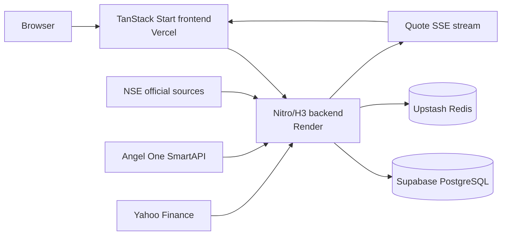
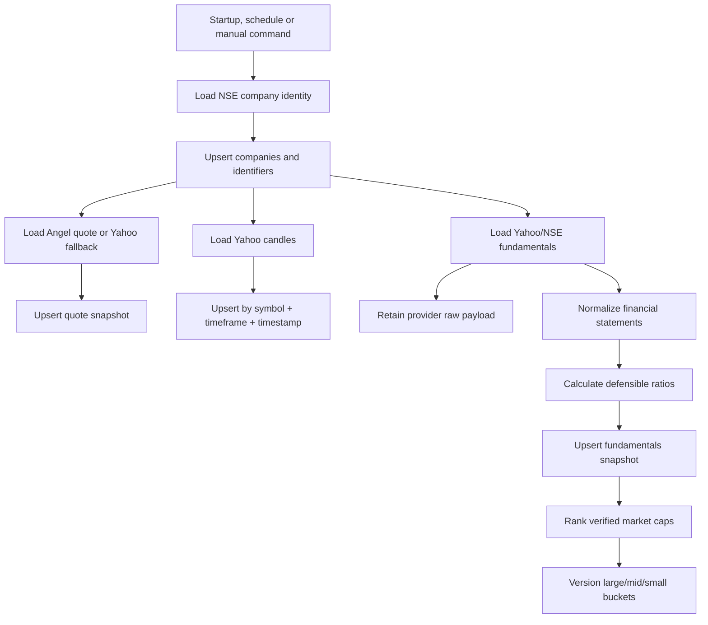

# MAET Architecture and Data Pipeline

Last verified: 2026-07-04

## 1. Purpose

MAET is a scanner-first Indian equity research terminal. Its primary product is
the NSE stock screener, supported by live/delayed quotes, stored price history,
normalized financial statements, calculated ratios, company detail pages, and
charts. It is a research and paper-trading application; it does not place real
money orders.

The central design rule is: **external providers populate or refresh trusted
data, while the website reads normalized data from MAET APIs and PostgreSQL
whenever possible**. Missing values remain unavailable; the system does not
generate substitute financial numbers.

## 2. System Overview



### Runtime components

- `src/`: TanStack Start, React, Vite, TanStack Router and React Query.
- `server/`: Nitro/H3 API server, workers, ingestion and domain logic.
- `shared/`: schemas and types shared between frontend and backend.
- Supabase PostgreSQL: durable company, quote, candle and financial data.
- Upstash Redis: quote/fundamental/candle caching, subscriptions, rate limits
  and idempotency support.
- Vercel: frontend SSR and static assets.
- Render: persistent backend process and worker orchestrator.

## 3. Data Sources and Responsibilities

| Source | Used for | Timing | Important limitation |
| --- | --- | --- | --- |
| NSE company master | Company name, symbol, ISIN, series, listing metadata | Full sync in the daily processor; cached in memory for six hours | NSE may block data-center IPs, so the backend has an official-data fallback path |
| Angel One instrument master | NSE symbol-to-token mapping | Hydrated when the backend starts | Mapping only; it is not the canonical company identity source |
| Angel One WebSocket/REST | Live prices, volume and previous close | WebSocket while subscribed; REST snapshot before Yahoo fallback | Requires valid broker credentials and an active session |
| Yahoo chart API | Delayed quotes and historical OHLCV candles | On demand, Yahoo polling, smoke tests and daily ingestion | Delayed and rate-limited; intraday history ranges are constrained |
| Yahoo fundamentals APIs | Market ratios and annual/quarterly financial data | Daily/bounded enrichment and company-detail fallback | `quoteSummary` may reject requests; public fundamentals-timeseries is the verified fallback |
| NSE HTML fundamentals | Secondary fundamentals/corporate-action source | Daily processor fallback | Fragile and may encounter CAPTCHA or data-center blocking |

NSE is the identity authority. Angel One is the live market authority when
connected. Yahoo is the historical and fundamentals enrichment source. Every
stored row records its source and timestamp where the schema supports it.

## 4. When Data Is Pulled

### Backend startup

`server/orchestrator.ts` starts with the Render backend and:

1. Starts the in-memory quote store and event bus consumers.
2. Starts the candle writer, market clock, screener runner and Yahoo poller.
3. Logs in to Angel One and opens the live WebSocket when credentials exist.
4. Loads more than 2,000 NSE equity instrument tokens for Angel subscriptions.
5. Starts the weekday daily-processor scheduler.

### While users browse

- The screener requests `/api/market/companies`. It queries PostgreSQL first.
  If PostgreSQL is unavailable, it falls back to the official NSE company
  master and disables filters whose stored fundamentals are unavailable.
- Only visible screener symbols are subscribed for quotes. Angel One is tried
  first; Yahoo is the delayed fallback.
- `/api/market/stream` sends quote updates to the browser over SSE.
- Chart requests query stored candles first. Missing or stale ranges are fetched
  from Yahoo, upserted into PostgreSQL, and returned. If persistence fails, the
  verified Yahoo response can still be displayed.
- Company detail reads the company, latest quote, fundamentals, statements and
  daily candles from PostgreSQL. Missing sections can be fetched from verified
  providers; unavailable fields remain blank with source explanations.

### Scheduled ingestion

The orchestrator checks once per minute and starts the daily processor at
**18:30 IST (13:00 UTC), Monday through Friday**, once per UTC date. The default
run performs:

1. NSE company-master synchronization.
2. Quote snapshot and candle synchronization for the configured symbols.
3. Yahoo/NSE fundamentals and financial-statement synchronization.
4. Deterministic ratio calculation.
5. Versioned Indian market-cap ranking.
6. Stale candle cleanup according to the retention rule.

The free Render instance must be awake at the scheduled time. For production
reliability, an external scheduled job should eventually invoke a protected
ingestion endpoint instead of relying only on an in-process timer.

### Manual bounded ingestion

Use these commands from the repository root:

```bash
# Five-symbol connection, write and idempotency check
bun run smoke:screener-v4

# Continue Nifty 500 fundamentals in bounded batches
ENRICH_OFFSET=310 ENRICH_LIMIT=25 bun run enrich:nifty500
```

Run one enrichment batch at a time. Advance the offset only to the
`nextOffset` printed by a successful run. The last verified batch processed
offsets 285-309 and reported `nextOffset: 310`.

## 5. Ingestion Lifecycle



All main writes use conflict targets so rerunning the same source period updates
the existing record rather than creating duplicates. The smoke test executes a
second pass and fails if counts change unexpectedly.

## 6. Database Model

### Scanner and company data

| Table | Purpose | Main uniqueness rule |
| --- | --- | --- |
| `companies` | Canonical NSE company record and latest searchable fields | Symbol primary key |
| `company_identifiers` | NSE symbol, ISIN, Yahoo symbol and future verified aliases | Identifier type + value |
| `quote_snapshots` | Timestamped price, change, volume and source | Company + source timestamp |
| `candles` | OHLCV history by timeframe | Symbol + timeframe + timestamp |
| `financial_statements` | Annual/quarterly normalized income, balance-sheet and cash-flow values plus raw payload | Company + period + period type + statement type |
| `fundamentals` | Sourced or calculated valuation, profitability, leverage, growth and market metrics | Snapshot ID; indexed by company and date |
| `market_cap_classifications` | Versioned rank-based Indian cap buckets | Company + classification version |

### Operational tables

- `users`, `brokers`, `orders`, `fills`: authenticated paper-order domain.
- `screener_runs`: saved screener definitions/runs for authenticated ownership.
- `backtest_runs`: persisted backtest results.
- `watchlist`, `alerts`, `idempotency`: user state and safe request handling.
- `source_audit`, `anomaly_flags`: schema exists, but ingestion writers are not
  connected yet; these tables currently remain empty.

### Last verified database state

- 2,058 companies.
- 6,174 verified identifiers.
- 55 quote snapshots.
- 491 candles.
- 318 fundamentals snapshots.
- 2,944 normalized financial-statement rows.
- 313 current market-cap classifications: 100 large, 150 mid and 63 small.

These numbers are an audit snapshot, not hard-coded application limits.

## 7. Ratio and Classification Rules

Ratios are calculated in `server/domain/fundamentals/ratios.ts` from normalized
statements and verified prices. The engine guards zero denominators and does not
publish misleading P/E values for negative earnings. Supported calculations
include P/E, P/B, EPS, book value per share, ROE, ROA, ROCE, debt/equity,
current ratio, margins, growth, cash flow and yield metrics when inputs exist.

Market-cap buckets use stored verified market caps ranked for the Indian
universe:

- Ranks 1-100: large cap.
- Ranks 101-250: mid cap.
- Ranks 251 onward: small cap.
- Missing market cap: unknown.

Each refresh creates a dated classification version and closes the previous
active version using `effective_to`.

## 8. API Surface

### Live public endpoints

| Method | Endpoint | Purpose |
| --- | --- | --- |
| GET | `/api/health`, `/health` | Backend and dependency health |
| GET | `/api/market/companies` | Database-first screener search, filters, sorting and pagination |
| GET | `/api/market/company` | Company detail, statements, ratios and stored history |
| GET | `/api/market/quotes` | Batch quotes with broker/Yahoo fallback |
| GET | `/api/market/candles` | Database-first historical candles |
| GET/SSE | `/api/market/stream` | Real-time quote stream |
| POST | `/api/backtest/run` | Deterministic backtest execution |
| GET/POST | `/api/trpc/*` | Authenticated alerts, companies, market, orders, portfolio and saved screener procedures |

### Explicitly unavailable or partial

- Verified options-chain and futures providers are not connected.
- Real broker order execution is not enabled.
- Analyst ratings and unsupported financial fields remain unavailable.
- Persistent saved screeners require a verified authenticated session; guests
  use local browser storage.
- Audit/anomaly tables exist but ingestion does not write them yet.

## 9. Frontend Request Flow

`src/lib/market-api.ts` is the frontend market API boundary. It uses
`VITE_API_URL` when configured and same-origin routes otherwise. React Query
handles request state and refreshes. Screener filters, sorting and pagination
are sent to the server rather than applied only to the current page.

The UI reports data provenance:

- DB stored: normalized persisted value.
- Angel live: broker stream or REST snapshot.
- Yahoo delayed: verified delayed provider value.
- `— unavailable`: no defensible source value; the tooltip explains why.

## 10. Caching and Failure Behavior

- Quote in-process cache: 15 seconds.
- NSE company master in-process cache: 6 hours.
- Yahoo candles and fundamentals use Redis keys defined in
  `server/data/redis/keys.ts`.
- HTTP screener/company responses include short CDN cache headers.
- Yahoo failures use bounded retries/backoff; persistent failure returns an
  honest unavailable or stale stored result.
- PostgreSQL failure does not invent values: public identity, quote and candle
  paths can degrade to verified provider responses.

## 11. Deployment and Required Environment

Vercel builds the frontend from `src`. Render uses `server` as its root, builds
the Nitro node-server bundle, and starts `.output/server/index.mjs`.

Required production secrets are configured only in provider dashboards or a
gitignored `.env` file:

- `SUPABASE_URL`, `SUPABASE_ANON_KEY`, `SUPABASE_SERVICE_ROLE_KEY`.
- `SUPABASE_DB_URL` using the transaction pooler, port 6543 and
  `sslmode=require`.
- `UPSTASH_REDIS_URL`.
- `ANGELONE_MASTER_KEY`, API key, client ID, PIN and TOTP secret.
- `NSE_HOLIDAYS_JSON` and allowed `FRONTEND_ORIGIN` values.

Never commit real values. `/api/health` must report REST, database and Redis as
reachable before the database-backed production screener is considered healthy.

## 12. Verification and Operations

Before release:

```bash
bun test
bun run typecheck
cd server && bun run build
cd ../src && bun run lint && bun run build
```

Then verify:

1. `/api/health` reports the expected dependencies.
2. `/screener` searches by symbol, company name and ISIN.
3. Database-backed valuation/cap filters are enabled.
4. A company detail page shows stored statements or an honest unavailable state.
5. Chart ranges return real candles and TradingView opens the correct NSE symbol.
6. The bounded smoke test passes twice without duplicate row growth.

Current unresolved production work is tracked only in
[`REMAINING-WORK.md`](./REMAINING-WORK.md).
